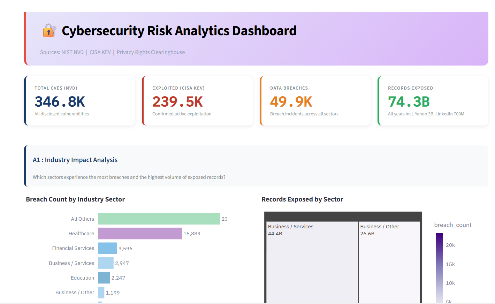
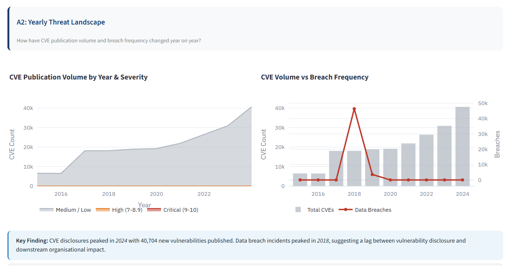
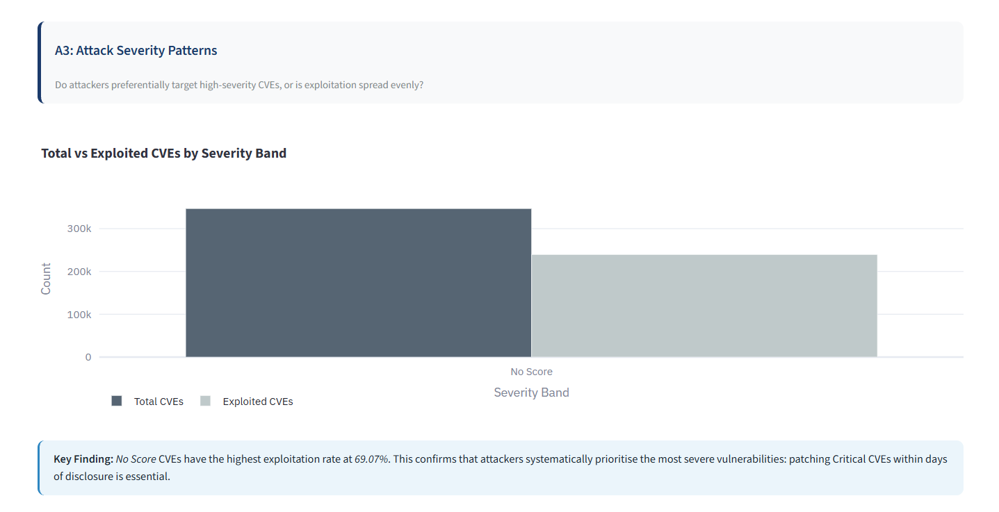
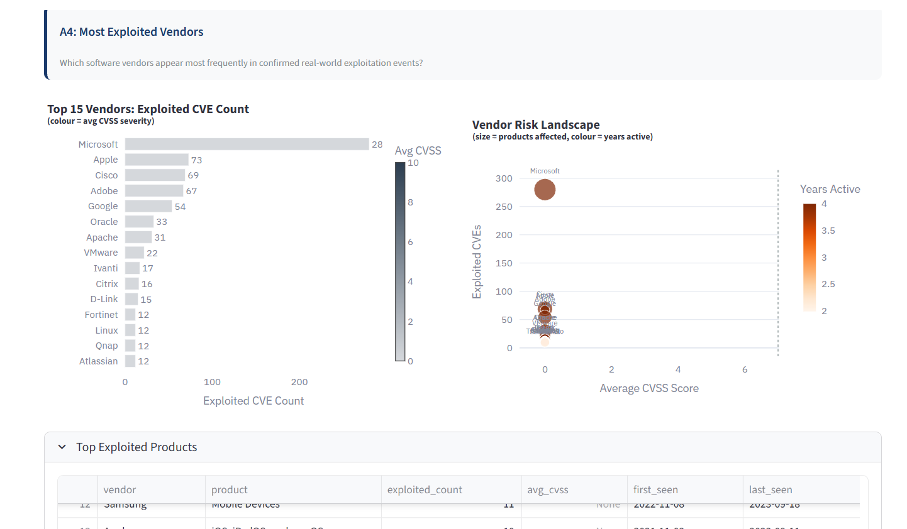
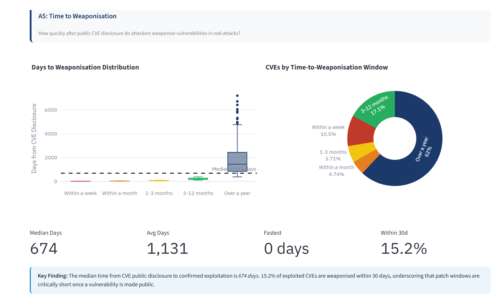

# Cybersecurity Incident and Vulnerability Risk Analytics

**Group E: MS Data Analytics, National College of Ireland**

| Student |
|---|
| Nilesh Barge| 
| Shivakshi | 
| Teena |

---

## Project Overview

Modern enterprises face a constantly shifting cybersecurity landscape where the gap between vulnerability disclosure and active exploitation continues to narrow. This project builds an integrated analytics pipeline that combines three real-world datasets — NVD CVE records, CISA Known Exploited Vulnerabilities, and Privacy Rights Clearinghouse breach data — to generate actionable enterprise-level cybersecurity intelligence.

### Provised Analysis On

| ID | Question |
|---|---|
| A1 | Which industry sectors experience the most breaches and the highest volume of exposed records? |
| A2 | How have CVE publication volume and breach frequency changed year on year? |
| A3 | Do attackers preferentially target high-severity CVEs? |
| A4 | Which software vendors appear most frequently in confirmed exploitation events? |
| A5 | How quickly after public CVE disclosure do attackers weaponise vulnerabilities? |

---

## Dashboard Preview

> **** : Full dashboard overview

> ** **

> ****

> ****

> ****

---

## Architecture

```
Data Sources
    NVD CVE API  
    CISA KEV       -> Kafka Topics  ->  MongoDB (raw)
    PRC Scraper              |
                             |
                    Dagster Pipeline (ETL)
                             │
                    |                |
              PostgreSQL           Neo4j
            (structured)          (graph)
                    |
              SQL Analysis
                    |
            Streamlit Dashboard
```

### Technology Stack

| Layer | Technology |
|---|---|
| Extraction | Python, requests, BeautifulSoup |
| Streaming | Apache Kafka |
| Raw Storage | MongoDB |
| Orchestration | Dagster |
| Transform | Python (pandas, dateutil) |
| Structured Storage | PostgreSQL |
| Graph Layer | Neo4j |
| Analysis | pandas, SQL |
| Visualisation | Streamlit, Plotly, Matplotlib, Seaborn |
| Version Control | Git / GitHub |

---

## Project Structure

```
cybersecurity_analytics/
src:
  extract
  kafka
  load
  transform
  integration
  graph
  analysis
  dagster_pipeline
  dashboard
  |
  requirements.txt
  .env
  README.md
```

---

## Prerequisites

Before running the project make sure the following are installed:

| Requirement | Version | Notes |
|---|---|---|
| Python | 3.11+ | |
| Java JDK | 17 LTS | Required for Kafka |
| Apache Kafka | 3.20 | Download from kafka.apache.org/downloads |
| MongoDB | 6.0+ | Local or MongoDB Atlas |
| PostgreSQL | 14+ | Local or ElephantSQL |
| Neo4j Desktop | 5.x | Download from neo4j.com/download |
| Git | any | |

---

## Environment Setup

### 1. Clone the repository

```bash
git clone https://github.com/NileshB1/cybersecurity-risk-analytics-pipeline.git
cd cybersecurity_analytics
```

### 2. Create and activate virtual environment

```bash
python -m venv .venv

# Windows
.venv\Scripts\activate.bat

# Mac / Linux
source .venv/bin/activate
```

### 3. Install dependencies

```bash
pip install -r requirements.txt
```

### 4. Configure environment variables

Copy `.env.example` to `.env` and fill in your credentials:

```bash
cp .env.example .env
```

```env
# MongoDB
MONGO_URI=mongodb://localhost:27017
MONGO_DB=cybersecurity_db

# PostgreSQL
PG_HOST=localhost
PG_PORT=5432
PG_DB=cybersecurity_db
PG_USER=postgres
PG_PASSWORD=yourpassword

# Neo4j
NEO4J_URI=bolt://localhost:7687
NEO4J_USER=neo4j
NEO4J_PASSWORD=yourpassword

# Kafka
KAFKA_BOOTSTRAP_SERVERS=localhost:9092

# NVD API Key (optional but recommended — get free at nvd.nist.gov/developers/request-an-api-key)
# Without a key: 5 requests/30s limit — NVD extraction takes 3-5 hours
# With a key: 50 requests/30s limit — NVD extraction takes ~20 minutes
NVD_API_KEY=your_key_here
```

---

## How to Run — End to End

### Step 1: Verify connections

Before running anything, confirm all services are reachable:

```bash
cd src
python test_connections.py
```

All five checks (MongoDB, PostgreSQL, NVD API, CISA KEV, Privacy Rights site) should show `PASS`.

---

### Step 2: Start Kafka

Open two separate terminals and keep them running throughout the entire pipeline.

**Terminal 1: Start Kafka broker:**
```bash
D:\kafka\bin\windows\kafka-server-start.bat D:\kafka\config\server.properties
```
Wait until you see: `[KafkaServer id=0] started`

**Terminal 2: Create the three topics** (one-time setup):
```bash
D:\kafka\bin\windows\kafka-topics.bat --create --topic nvd_cve_stream --bootstrap-server localhost:9092 --partitions 3 --replication-factor 1

D:\kafka\bin\windows\kafka-topics.bat --create --topic kev_stream --bootstrap-server localhost:9092 --partitions 3 --replication-factor 1

D:\kafka\bin\windows\kafka-topics.bat --create --topic breach_stream --bootstrap-server localhost:9092 --partitions 3 --replication-factor 1
```

Verify topics created:
```bash
D:\kafka\bin\windows\kafka-topics.bat --list --bootstrap-server localhost:9092
```

---

### Step 3: Extract raw data

Run each extractor to pull data and write raw JSON backup files:

```bash
# CISA KEV catalog
.\.venv\Scripts\python.exe src\extract\kev_extractor.py
# output: kev_raw.json

# Privacy Rights Clearinghouse breach records
.\.venv\Scripts\python.exe src\extract\breach_scraper.py
# output: breach_raw.json

# NVD CVE API: it is the slowest (3.5K +records)
.\.venv\Scripts\python.exe src\extract\nvd_extractor.py
# output: cve_raw.json
```

---

### Step 4: Load raw JSON files into MongoDB

```bash
.\.venv\Scripts\python.exe src\load\json_to_mongo_loader.py --file cve_raw.json

.\.venv\Scripts\python.exe src\load\json_to_mongo_loader.py --file kev_raw.json

.\.venv\Scripts\python.exe src\load\json_to_mongo_loader.py --file breach_raw.json
```

Verify MongoDB collections
```

---

### Step 5: Create PostgreSQL schema

Run this once to create all four tables and indexes:

```bash
psql -h localhost -U postgres -d cybersecurity_db -f src\load\postgres_schema.sql
```

---

### Step 6: Run Dagster pipeline (ETL)

The Dagster pipeline handles 1. Transform 2. Load 3. Analysis automatically.

```bash
cd src
dagster dev
```

Open `http://localhost:3000` in your browser.

- Go to **Lieage** tab
- Click **Materialise All**
- Watch each asset turn green: `read_mongo_raw` → `transform_data` → `load_to_postgres` → `run_analysis`


The pipeline will:
- Read raw records from MongoDB
- Clean, normalise and deduplicate all three datasets
- Load cleaned records into PostgreSQL
- Run all five analysis queries and export CSVs to `analysis/output/`

---

### Step 7: Run graph analytics

After the Dagster pipeline completes:

```bash
cd src

# merge CVE and KEV data, calculate time_to_exploit
python integration\cve_kev_merge.py

# neo4j steps are OPTIONAL....
# load graph into Neo4j (make sure Neo4j Desktop is running first)
python graph\neo4j_loader.py

# run centrality, community detection, vendor risk scoring
python graph\graph_insights.py

# generate graph analytics report
python graph\graph_report.py
# output: graph/reports/graph_analytics_report.txt
```

---

### Step 8: (Optional) Generate figures

Produces eight PNG charts for the project report:

```bash
cd src
python analysis\report_charts.py
# output: analysis/report_figures/*.png
```

---

### Step 9: Run the dashboard

```bash
cd src
streamlit run dashboard\streamlit_app.py
```

Open `http://localhost:8501` in your browser.

The dashboard shows:
- **A1** Industry Impact Analysis
- **A2** Yearly Threat Landscape
- **A3** Attack Severity Patterns
- **A4** Most Exploited Vendors
- **A5** Time to Weaponisation

---

## Data Sources

| Source | Description | Access |
|---|---|---|
| [NIST NVD CVE API](https://nvd.nist.gov/developers/vulnerabilities) | All publicly disclosed software vulnerabilities | Free API (key recommended) |
| [CISA KEV Catalog](https://www.cisa.gov/known-exploited-vulnerabilities-catalog) | Vulnerabilities confirmed exploited in the wild | Free JSON feed |
| [Privacy Rights Clearinghouse](https://privacyrights.org/data-breaches) | Historical data breach incident records | Web scraping |

---
